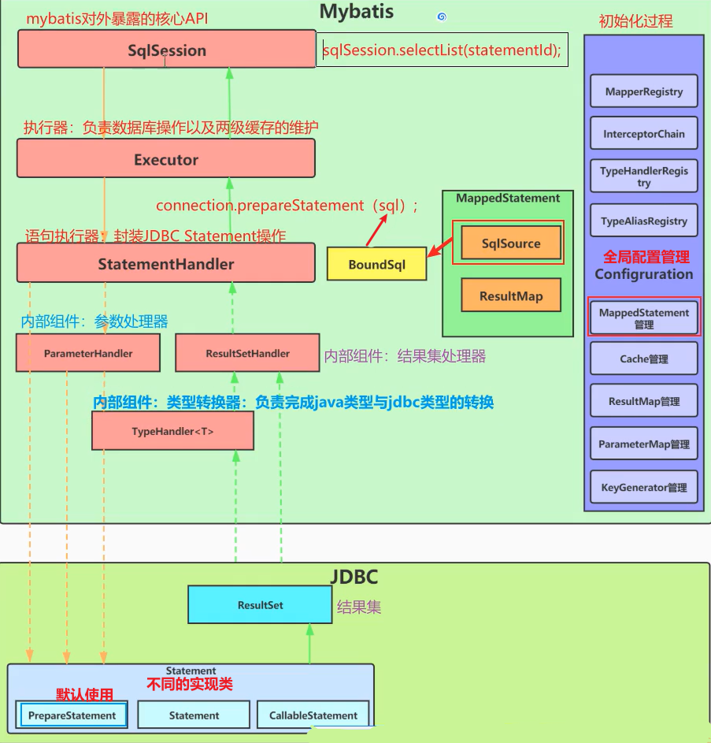

# 手写 Mybatis 


为了方便回顾与总理，我将架构图放在最前面，或许对初学者而言不太友好，但请将其作为一份地图，后续探宝你会需要到它的

提出疑问，疑问可以帮助我们更好的理解整个架构以及如何进行总结

1. 初始化-如何解析全局配置文件
2. 初始化-如何解析映射配置文件
3. SqlSource 创建流程
4. SqlSession 执行主流程
5. 如何设置参数
6. 结果集映射的主要流程
7. 获取 Mapper 代理对象的流程
8. invoke 方法怎么执行的
9. 插件机制是什么
10. 缓存机制

## 为什么需要 mybatis
整个 mybatis 源码从狭义的角度来说就是对原始 JDBC 进行封装抽象

思考一下我们没有接触到 mybatis 前是怎么通过 JDBC 进行数据库连接的呢? 

给一段 JDBC 代码参考：

```java 
    Connection connection = null; // 数据库驱动
    PreparedStatement prepareStatement = null; // sql 预处理对象
    ResultSet result = null; // 结果集对象
    try {
        // 加载数据库驱动
        Class.forName("com.mysql.jdbc.Driver");
        // 通过驱动管理类获取数据库连接
        connection = DriverManager.getConnection(
            "jdbc:mysql://localhost:3306/数据库名?characterEncoding=utf-8", 
            "用户名", "密码");
        // 定义 sql 语句, 原始 JDBC 只能处理 ? 占位符
        String sql = "select user_head from user where user_id = ?, username = ?";
        // 获取预处理后的 statement 
        prepareStatement = connection.prepareStatement(sql);
        // 设置参数, 第一个参数为 sql 语句中参数的序号(从1开始), 第二个参数为设置的参数值
        prepareStatement.setInteger(1, 10001); // 对应 sql 语句的 user_id = 10001;
        prepareStatement.setString(2, "tom"); // 对应 sql 语句的 username = "tom";
        
        // 向数据库发送 sql 执行查询请求，查询出结果集
        resultSet = prepareStatement.executeQuery();
        // 遍历查询结果集
        while(resultSet.next()) {
            String userHead = resultSet.getString("user_head");
            // 封装 User 对象
            user.setId(10001);
            user.setUsername("tom");
            user.setHead(userHead);
        }
    } catch (Exception e) {
        e.printStackTrace();
    } finally {
        // 释放资源
        if (connection != null) {
            connection.close();
        }
    }
```

我们来思考一下这段 JDBC 代码存在哪些问题

1. 数据库配置信息硬编码
2. 频繁创建和释放数据库连接资源
3. sql 语句、参数、返回结果集获取都存在硬编码问题
4. 需要手动封装返回结果集，较为繁琐

为此，mybatis 有哪些应对措施呢?

1. 数据库配置信息硬编码 --> 配置文件封装
2. 频繁创建和释放数据库连接资源 --> 享元模式连接池节省资源开销
3. sql 语句、参数、返回结果集获取都存在硬编码问题 --> 配置文件封装
4. 需要手动封装返回结果集，较为繁琐 --> 反射技术根据字段名和实体属性名对应关系自动完成映射封装

那我们就可以做一个简单的总结了

Mybatis 作为一个半 ORM 框架，本质就是对 JDBC 进行了封装抽象

不过在实现的过程中，通过采用配置文件、数据库连接池、反射、内省等技术把原始 JDBC 所存在的问题进行了规避

## Mybatis 文件格式

mybatis 中 xml 语法书写总体配置文件 `mybatis-config-datasource.xml`

mybatis 资源读取器只会读取这个配置文件，对应的 mapper 集成在这里，这样的好处是只调用一次 getResourceAsStream(String resource)

需要注意的是，springboot 可以通过 yml 文件设置 configuration，并且根据约定大于配置的思想，
只要 springboot 项目里的 mapper.xml 文件放在对应的路径便可扫描到。也就是说无需总体配置文件`mybatis-config-datasource.xml`

本项目目前还没集成到 springboot

```xml
<configuration>
    <environments default="development">
        <environment id="development">
            <transactionManager type="JDBC"/>
<!--            <dataSource type="UNPOOLED">-->
            <dataSource type="POOLED">
                <property name="driver" value="com.mysql.jdbc.Driver"/>
                <property name="url" value="jdbc:mysql://127.0.0.1:3306/jdbc?useUnicode=true"/>
                <property name="username" value="root"/>
                <property name="password" value="123456"/>
            </dataSource>
        </environment>
    </environments>

    <mappers>
        <mapper resource="mapper/User_Mapper.xml"/>
    </mappers>
</configuration>
```

mybatis 中 xml 语法书写 sql 语句

```xml
<mapper namespace="com.bantanger.mybatis.test.dao.IUserDao">
    <select id="queryUserInfoById" parameterType="java.lang.Long" resultType="com.bantanger.mybatis.test.po.User">
        select id, userId, userHead, createTime
        from user
        where id = #{id};
    </select>
</mapper>
```

资源读取 `XMLConfigBuilder`

mybatis 怎么对这个 xml 标签进行拆解的

+ 原始 sql 语句通过 **对象处理器** `StatementHandler` 进行 sql 参数预处理，将占位符替换成 ?, 并将参数名称缓存到 parameterMappings 集合里
+ 最终 sql 语句执行委托给 **执行器** `Executor`, 执行器调用底层封装的 JDBC 接口
+ 结果集对象 resultSet 交付给 **结果集处理器** `ResultSetHandler`, 通过反射技术将结果集自动封装成实体对象 

## 解析全局配置类
核心方法 `SqlSessionFactoryBuild.build()`，不仅是以创造者模式构建 SqlSessionFactory 工厂来生成 sqlSession，更是解析字节输入流，也就是配置文件内容的核心入口

> 创建者模式
> 
> 当需要构建的对象有多个成员变量(4个以上)就可以考虑使用创建者模式，它能降低耦合以及分离复杂对象创建
> 

在 mybatis 源码中，它有三个重载方法

.png)

其中较为重要的是第二个方法的形参 `String environment`

需要传入 environmentId，也就是标签 `<environment id="development">` 里的 "development"

其目的是用于多数据源选择切换。因为在开发中一般数据库分为线上数据库和测试数据库，可以通过这个 build 方法传递 environmentId 来切换不同的数据源对象

## sqlSession 接口是什么

内部封装了原始的 CRUD 逻辑, selectOne、selectList、update、delete、insert。

底层还是调度 JDBC 中 preparedStatement 里的两个核心接口方法 `executeQuery`、`executeUpdate`

由于会出现多个 mapper 对象共用一套 CRUD 原始接口的情况(例如 User_Mapper 里会有 selectOne，House_Mapper 里也会有 selectOne)，
为了避免混乱，需要对每一个 mapper 里的方法设置唯一标识的方式来定位。

所以可以看到 sqlSession 里的原始 CRUD 接口都有形参 `String statementId`。格式为 `statementId = namespace.id`

以每一个 mapper.xml 文件独一无二的定位标识 namespace 加上每个方法的唯一 id (就是方法名 name) 构成

> 为了达成这样一个唯一标识 statementId, mybatis 不得不做出一定的配置规范，而不能让用户随心所欲的书写配置文件
> 
> 必须保证两个规范：
> 
> 首先就是 mapper.xml 文件中的 namespace 值必须与需扫描的 mapper 接口全路径**保持一致**
> 
> 然后便是 mapper 接口中的方法名称要和 mapper.xml 文件中的标签 id **保持一致**

实际上，我们 sqlSession 为了实现隐式方法调用，而不至于让用户做过多的操作，内部实现了动态代理

而使用动态代理，就需要知道具体的方法名称，并为此通过反射技术实现调用

但无论怎样，从**宏观角度**来看，反射技术调用方法，实际上还是需要通过执行器 Executor 来调度底层的 JDBC 代码
为此需要上文提到的 `statementId` 定位唯一 `mappedStatement` 对象和 `Object parameter`
_(只是 Object 类型的参数，形参列表形式会经过一层转换，统一封装成一个 Object 类型)_

而从**微观角度**来看，最终都是执行底层的 JDBC 接口中的 prepareStatement.execute 方法，
为此还需要核心参数 `String finalSql`, finalSql 表示占位符被替换成 ? 的最终 sql, 因为底层 JDBC 只能识别 ? 占位符

而 sqlSession 怎么知道调用 CRUD 中哪个方法呢? 简单粗暴的逻辑就是通过正则，直接提取出到底是什么方法开头，但实在是不优雅。
因此 mybatis 在一开始解析 mappedStatement 时就将 sql 标签类型存储在 SqlCommandType 里，一来不用再次解析文本，二来可以很优雅的通过 switch 的方式获取到底要执行 CRUD 哪个类型方法

## reflection 反射工具包
在 `07_reflection` 以前的分支, 在实现数据源池化时，获取属性信息采用的是硬编码方式，也就是属性都是通过手动编码的方式获取
``` java
@Override
public DataSource getDataSource() {
    // 配置动态数据源
    DruidDataSource dataSource = new DruidDataSource();
    dataSource.setDriverClassName(props.getProperty("driver"));
    dataSource.setUrl(props.getProperty("url"));
    dataSource.setUsername(props.getProperty("username"));
    dataSource.setPassword(props.getProperty("password"));
    return dataSource;
}
```
虽说 driver、url、username、password 都是标准固定字段，但除了这些字段还会配置一些扩展字段。这些就不能通过硬编码方式获取

mybatis 源码的设计中有一个 reflection 包，内部的源对象反射工具类 MetaObject 可以完成一个对象属性的反射填充。

反射难免会遇到私有方法，需要先检查当前程序的安全策略是否允许程序访问或者修改对象的私有属性或者方法

``` java
System.getSecurityManager().checkPermission(
    new ReflectPermission("suppressAccessChecks"));
```